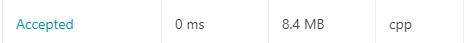

题意并不难理解：将输入的数字（int）反转，如果是负数-zx，那么就要输出为-xz

题目中特意给了这么一个提示：int的范围是[-2^31,2^31-1],而且说明了如果反转之后的数超出了int范围，直接返回0即可。

最开始我的代码是这样式的：

	class Solution {
	public:
	    int reverse(int x) {
	        int result;
	        unsigned int limit = 2 << 30;
	        unsigned int y = abs(x);
	        long long t_result = 0;
	        while(y){
	            t_result = (t_result*10) + (y%10);
	            y = y / 10;
	        }
	        if(t_result > limit) return 0;
	        if(x < 0) result = t_result * -1;
	        else result = t_result;
	        return result;
	    }
	};

十分直白，十分通用的一个做法，唯一要注意的是正负数的区别，我想的是先全部转成正数做反转，符号之后再加。

我在本地测试过没问题，但是上面的代码交到oj上不能过遇到绝对值最大的那个负数不能过！！报错说是溢出，可是我本地明明没这个问题。。

我最开始还是挺纳闷的，所以就改成这样，我先用长整型存一遍参数，这不管怎么搞都不会错了吧

	class Solution {
	public:
	    int reverse(int x) {
	        int result;
	        long long xx = x;
	        unsigned int limit = 2 << 30;
	        unsigned int y;
	        y = (xx<0)?(xx*-1):xx;
	        long long t_result = 0;
	        while(y){
	            t_result = (t_result*10) + (y%10);
	            y = y / 10;
	        }
	        if(t_result > limit) return 0;
	        if(x < 0) result = t_result * -1;
	        else result = t_result;
	        return result;
	    }
	};

果然不负所托，居然跑出了0ms :scream:

这道题的数据量是真的小呀。。

最开始的问题我后来查了一下，发现是abs函数的问题，abs函数的声明是这样的 `int abs(int a)`

也就是说你丢入一个int，只能给你返回一个int，而INT_MAX和INT_MIN的绝对值又不对称，所以肯定就溢出了

所以，就失败喽。。这种细节不遇到一次真的不知道，写代码还是要规范

本地环境没问题可能是因为本地的编译器和c++ reference 给出的不一样。

后来看到了一份写的特别整洁的

	class Solution {
	public:
	    int reverse(int x) {
	        int rev = 0;
	        while (x != 0) {
	            int pop = x % 10;
	            x /= 10;
	            if (rev > INT_MAX/10 || (rev == INT_MAX / 10 && pop > 7)) return 0;
	            if (rev < INT_MIN/10 || (rev == INT_MIN / 10 && pop < -8)) return 0;  //这里的8和7分别是INT_MIN/MAX的个位数字
	            rev = rev * 10 + pop;
	        }
	        return rev;
	    }
	};

只有13行 :dizzy:  大佬还是强呀，上面的溢出判断做的很准确

