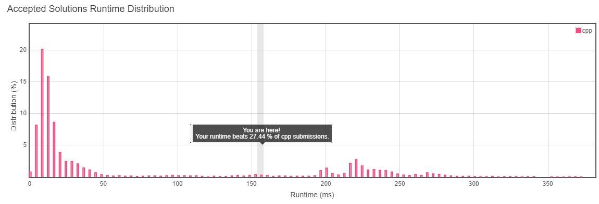
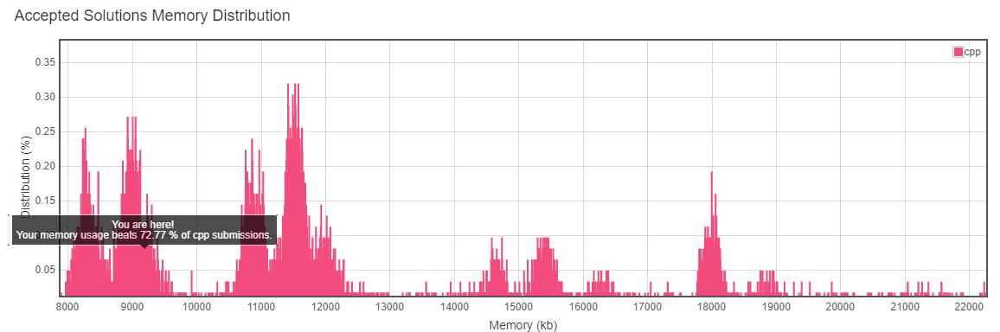

这道题是让实现一个简单的正则匹配，但是特殊字符只有两个：.和*

. 可以匹配任意字符，* 表示前一个字符可以出现任意次数,包括0。如果前一个字符是.，那么就是.可以出现n次，并不是.匹配的那个字符出现n次

最开始我的解法就是暴力，遇到 * 前一个字符成功匹配的位置就递归。但是正常字符和 . 成功匹配的情况是有不同的，具体见代码

```
	bool isMatch(string s,string p){   //p是模板
		if(s==""){
			if(p.size() % 2) return false;
			for(int i = 0;i < p.size();i+=2){
				if(i+1<p.size() && p[i+1]!='*') return false;
			}
			return true;
		}
		int s_len = s.size(),p_len = p.size(),s_i = 0,p_i = 0;
		while(s_i<s_len && p_i<p_len){
			char c_s=s[s_i], c_p=p[p_i], 
				 c_p_next=(p_i+1==p_len)?'1':p[p_i+1], 
				 c_p_last=(p_i>0)?p[p_i-1]:'1';

			
			if(c_s != c_p){  
				if(c_p != '.'){   //如果字符串p对应的字符不是.，有可能是
					if(c_p_next != '*') return false;
					else{
						p_i += 2;
					}
				}
				else{  
					if(c_p_next == '*'){  
						int t_s_i=s_i,t_p_i=p_i+2;
						if(t_p_i >= p_len) return true;
						
						while(t_p_i < p_len){
							while(t_s_i < s_len){
								if((s[t_s_i]==p[t_p_i]||p[t_p_i]=='.') && isMatch(s.substr(t_s_i),p.substr(t_p_i))) return true;
								t_s_i++;
							}
							if(t_p_i+1<p_len && p[t_p_i+1]=='*'){
								t_p_i += 2;
								t_s_i = s_i;
							}
							else return false;
						}
						return true;
					}
					else{ 
						p_i++;s_i++;
					}
				}
			}
			else{
				if(c_p_next == '*'){
					int t_s_i = s_i+1,t_p_i = p_i+2;
					while(t_s_i<s_len && s[t_s_i]==c_s) t_s_i++;
					while(t_p_i<p_len && p[t_p_i]==c_s) t_p_i++;
					if(t_p_i>=p_len && t_s_i>=s_len && t_s_i-s_i-1>=t_p_i-p_i-3) return true;
					for(int j = s_i;j <= t_s_i;j++){
						if(isMatch(s.substr(j),p.substr(p_i+2))) return true;
					}
					return false;
				}
				else{
					s_i++;
					p_i++;
				}
			}
		}

		if(s_i == s_len){
			if(p_i == p_len) return true;
			else return isMatch(s.substr(s_i),p.substr(p_i));
		}
		else return false;
	}
```
上面代码特别长，时间也用的特别多，而且因为用到了递归，所以内存上用的并不算少

最开始的结果是这样的


<center>测试</center>



后来看到了另外一份递归的代码，时间只有40ms。写的特别好，函数里面没有那么多的判断，只针对当前要匹配的两个字符，把每种情况考虑清楚，然后分支、递归

```
	bool isMatch(string s, string p) {
        return helper(0, 0, s, p);
    }
    
    //i,j分别表示s和p将要匹配的位置，这个函数只考虑当前的位置的情况，根据当前位置的情况进行分支
    bool helper(int i, int j, const string &s, const string &p) { 
        if (i == s.size() && j == p.size()) {
            return true;
        }
        if (i != s.size() && j == p.size()) {
            return false;
        }

        if (i == s.size() && j != p.size()) {
            if (p.size() >= j + 2 && p[j + 1] == '*') {
                return helper(i, j + 2, s, p);
            }
            return false;
        }

        if (j < p.size() - 1 && p[j + 1] != '*') {
            if (s[i] == p[j] || p[j] == '.') {
                return helper(i + 1, j + 1, s, p);
            }
            return false;
        }
        
        if (j < p.size() - 1 && p[j + 1] == '*') {
            if (s[i] == p[j] || p[j] == '.') {
                return helper(i, j + 2, s, p) || helper(i + 1, j, s, p);
            }
            return helper(i, j + 2, s, p);
        }
        
        if (i == s.size() -1 && (s[i] == p[j] || p[j] == '.')) {
            return true;
        }
        return false;
    }
```

关于递归的还有更加简短的

```
	bool isMatch(string s, string p) {
        if(p.empty()) return s.empty();
        if(s.empty()) return p.empty() || (p[1] == '*' ? isMatch(s, p.substr(2)) : false);
        if(p[0] != '.' && s[0] != p[0]) return p[1] == '*' ? isMatch(s, p.substr(2)) : false;
        if(p[1] == '*') return isMatch(s.substr(1), p) || isMatch(s, p.substr(2));
        return isMatch(s.substr(1), p.substr(1));
    }
```

更好的方法是DP
```
	bool isMatch(string s, string p) {
	    int m = s.size(), n = p.size();
	    vector<bool> cur(n + 1, false);
	    for (int i = 0; i <= m; i++) {
	        bool pre = cur[0];
	        cur[0] = !i;
	        for (int j = 1; j <= n; j++) {
	            bool temp = cur[j];
	            if (p[j - 1] == '*') {
	                cur[j] = cur[j - 2] || (i && cur[j] && (s[i - 1] == p[j - 2] || p[j - 2] == '.'));
	            } else {
	                cur[j] = i && pre && (s[i - 1] == p[j - 1] || p[j - 1] == '.');
	            }
	            pre = temp;
	        }
	    }
	    return cur[n];
	}
```
上面的代码还有一些地不懂，但基本思想是标记能够将s的i位置上的字符也匹配进去的位置

其实更通用的是使用二维数组，dp[i][j]表示的是s的前i个字符和p的前j个字符是不是匹配，相比上面的代码来说，直观的多
