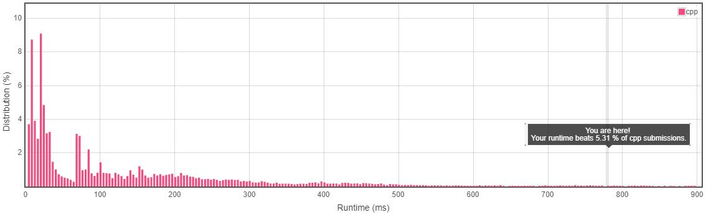
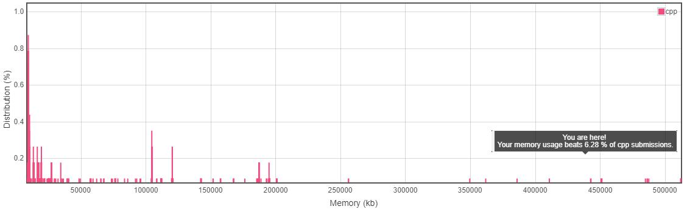
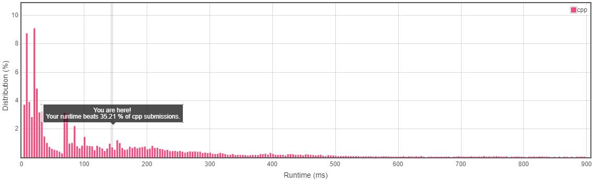
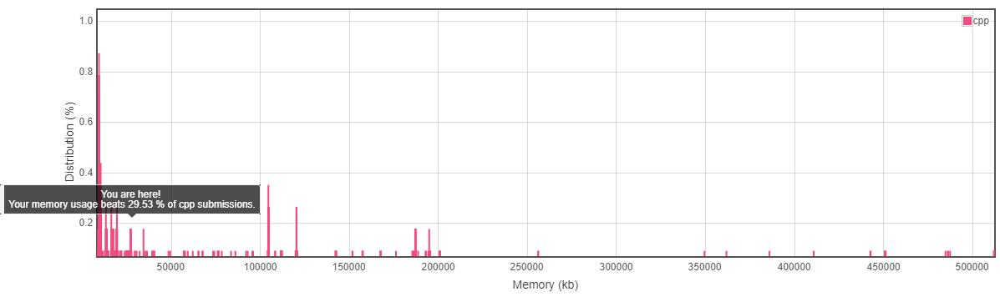

题意简单易懂，就是在一个字符串中找到一个最长的回文子串。

**子串**和**回文串**的定义不再赘述。

Approach1：
对每个位置的子串都进行验证，对每个位置都进行一次遍历需要O(n^2)

如果使用遍历的方式验证子串是不是回文串，最终的时间复杂度是O(n^2)

但是可以考虑回文串的性质而减少回文串验证的时间复杂度。

最开始考虑用dp，代码如下

	class Solution {
	public:
	    string longestPalindrome(string s) {
		if(s == "") return "";
		int max_len = 1,sta = 0;
		vector<vector<int> >palin;
		for(int i = 0;i < s.size();i++){
		    vector<int> temp;
		    for(int j = 0;j < s.size();j++) temp.push_back(i == j);
		    palin.push_back(temp);
		}

		for(int i = 1;i <= s.size() - 1;i++){
		    for(int j = 0;j+i < s.size();j++){
			if(s[j] == s[j+i]){
			    if(i > 1){
				if(palin[j+1][i+j-1]){
				    if(i + 1 > max_len){
					sta = j;max_len = i + 1;
				    }
				    palin[j][j+i] = 1;
				}
			    }
			    else {
				palin[j][j+1] = 1;
				sta = j;
				max_len = 2;
			    }
			}
		    }
		}

		return s.substr(sta,max_len);
	    }
	};

但是效果不是特别好，内存、时间都用的多。

**后来查了一下，dp中的状态矩阵可以使用二进制简化，更改之后的代码如下：**

	class Solution {
	public:
	    string longestPalindrome(string s) {
		if(s == "") return "";
		int bit_len = s.size()/32,bit_p,bit_r;
		bit_len += ((s.size() % 32) > 0);
		int max_len = 1,sta = 0;
		vector<vector<unsigned int> >palin;
		for(int i = 0;i < s.size();i++){
		    vector<unsigned int> temp(bit_len,0);
		    bit_p = i >> 5;bit_r = i % 32;
		    temp[bit_p] = 1 << bit_r;
		    palin.push_back(temp);
		}

		for(int i = 1;i <= s.size() - 1;i++){
		    for(int j = 0;j+i < s.size();j++){
			if(s[j] == s[j+i]){
			    if(i > 1){
				bit_p = (i+j-1) / 32;bit_r = (i+j-1) % 32;
				if((palin[j+1][bit_p] & (1<<bit_r)) > 0){
				    if(i + 1 > max_len){
					sta = j;max_len = i + 1;
				    }
				    bit_p = (j+i)/32;bit_r = (i+j)%32;
				    palin[j][bit_p] |= (1<<(bit_r));
				}
			    }
			    else {
				bit_p = (j+1) / 32;bit_r = (j+1) % 32;
				palin[j][bit_p] |= (1<<bit_r);
				sta = j;
				max_len = 2;
			    }
			}
		    }
		}

		return s.substr(sta,max_len);
	    }
	};

改了之后的效果如下：

更改的方式主要是将每个存状态的变量由int转为了bit，节省了将近32倍的空间

而且因为位运算得天独厚的优势，运行时间也得到了加成

第t位设置为1的方式是 `x = x | (1 << t)` 验证第t位是不是1的方式是`x & (1 << t) > 0`

原理虽然不难，但是改的时候也遇到了一个很难发现的问题，如果使用'int'来当作*bit*的容器

因为'int'使用补码来存嘛，所以如果最高是1会发生溢出，讲道理来说这对验证是不是为1并没有什么影响，但是结果不对

后来我改成'unsigned int'才过

好多事不做一遍真的不知道是什么样子呀

